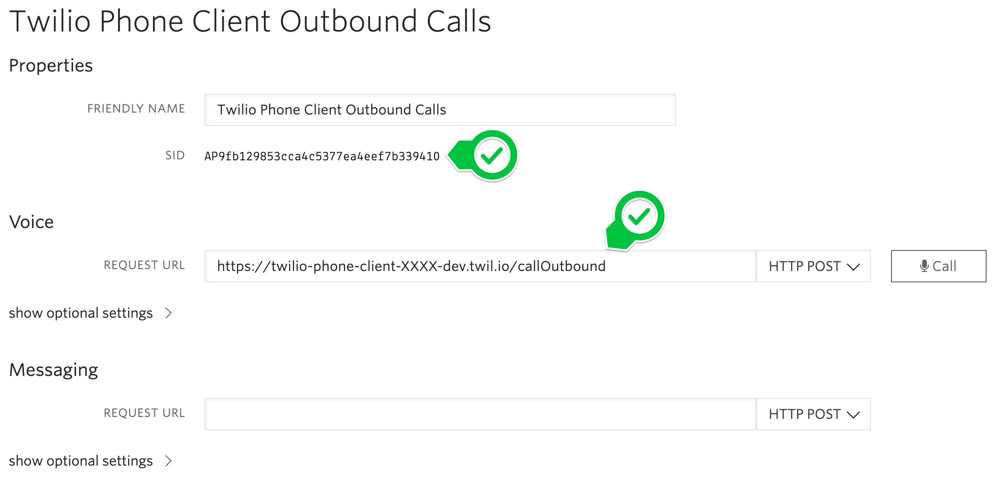

# Installation

Before you start, make sure you have [Twilio CLI](https://www.twilio.com/docs/twilio-cli/quickstart) and its [serverless plugin](https://www.twilio.com/docs/twilio-cli/plugins#available-plugins) installed and working.

Then there are couple things that need to be prepared before the installation:

1. Note down your [Account SID](https://www.twilio.com/console)
2. Create and note down [API key & secret](https://www.twilio.com/console/project/api-keys)
3. Create a [Programmable Chat Service](https://www.twilio.com/console/chat/services) and note down its SID

Now clone this repository:

```
$ git clone 
$ cd 
```

And install dependencies and deploy it to your Functions for the first time:

```
$ npm install                    # install React dependencies
$ cd deploy; npm install; cd ..  # install Twilio Runtime dependencies
$ npm run deploy                 # test deploy your application to get its public URLs
...
Functions:
   [protected] https://twilio-phone-client-XXXX-dev.twil.io/callInbound  <<< note down the /callInbound URL
   [protected] https://twilio-phone-client-XXXX-dev.twil.io/callOutbound <<< note down the /callOutbound URL
   [protected] https://twilio-phone-client-XXXX-dev.twil.io/msgInbound   <<< note down the /msgInbound URL
   https://twilio-phone-client-XXXX-dev.twil.io/getAccessToken
   https://twilio-phone-client-XXXX-dev.twil.io/msgOutbound

```

Your phone client will **not work** at this point.

4. Purchase a [Twilio phone number](https://www.twilio.com/console/phone-numbers/incoming) and note it down (if you plan to use both SMS and calls, make sure your phone number has both capabilities).

In the phone number's configuration, set the "A Call Comes In" Webhook to the `/callInbound` URL you have collected above.


Then set the "A Message Comes In" Webhook to the `/msgInbound` URL you have collected above.


After you hit the Save button, both webhooks will update to a Function, that is expected.

5. Create a new [TwiML App](https://www.twilio.com/console/voice/twiml/apps) and set its Voice Request URL to the `/callOutbound` URL you have noted in the previous step. Save it and then go back to the TwiML App's configuration and note down its SID.



6. Set your password

Since the phone client is deployed on a public URL, anyone who knows/guesses the URL can potentially use it. Therefore the client is password-protected by default. The password that you need to enter when accessing the client is controlled by the `SECRET` env variable set in the next step. Set it to any string.

If you do not want the client to be password-protected, you can set the `SECRET` variable to an empty string (this is not recommended however).

7. Save the collected information and deploy

```
$ cp deploy/.env.sample deploy/.env
$ vim deploy/.env   # fill in information collected in the previous steps
ACCOUNT_SID=ACxxx
API_KEY=SKxxx
API_SECRET=xxx
CHAT_SERVICE_SID=ISxxx
TWILIO_NUMBER=+1xxx
TWIML_APP_SID=APxxx
SECRET=some_password

$ npm run deploy    # deploy your application for the 2nd time
...
Assets:
   https://twilio-phone-client-XXXX-dev.twil.io/asset-manifest.json
   https://twilio-phone-client-XXXX-dev.twil.io/favicon.ico
   https://twilio-phone-client-XXXX-dev.twil.io/index.html  <<< this is your client's URL
   ...
```

8. Now you can open the deployed `index.html` URL in your web browser and start your phone client.

**Pro tip:** To run the client in its own resizable window with minimal window chrome, you can use something like this:

macOS: `/Applications/Google\ Chrome.app/Contents/MacOS/Google\ Chrome --app="https://twilio-phone-client-XXXX-dev.twil.io/index.html"`

Windows: `chrome --app="https://twilio-phone-client-XXXX-dev.twil.io/index.html"`
